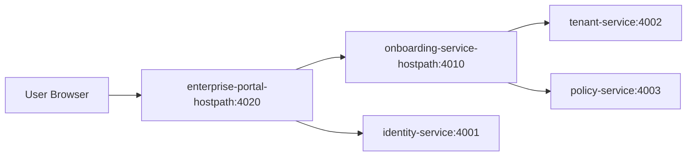

1. **I can create and maintain component + system architecture diagrams.**
2. **We can implement and verify UX services milestone-by-milestone with unit tests.**
3. **Yes, every milestone can be deployed and signed off on local Kubernetes.**

---

## 1) Diagrams to keep as source of truth

### A. System Context Diagram (C4 L1)

- Actors: End users, tenant admins, enterprise IdP, channel platforms, ClawHub.
- Platform boundary includes both secure core services and enterprise UX services.

### B. Container / Service Diagram (C4 L2)

- Core services + UX services:
  - Enterprise Web Portal
  - Onboarding Experience Service
  - Account Setup API
  - Channel Provisioning Orchestrator
  - Skills Catalog & Install API
  - Credential Broker
  - User Notification Service
  - Channel Setup Assistant

### C. Kubernetes Deployment Diagram

- Add UX service deployments, ingress routes, and credential-broker trust boundaries.

### D. UX Sequence Diagrams

- Self-serve signup -> verify -> login -> bootstrap
- Invite-only activation
- Guided channel connection (OAuth/token/QR)
- Skill install from UI and channel invocation
- First-run happy path E2E

---

## 2) Updated component milestones (secure platform + UX)

### Milestone 0 — Foundation & Architecture Sign-off

**Build**

- baseline diagrams, contracts, auth context spec

**Tests**

- contract/schema checks

**Local K8s deploy**

- none required

**Sign-off gate**

- architecture approval

### Milestone 1 — Identity Service (SSO MVP)

**Build**

- OIDC login, callback, refresh, logout

**Unit tests**

- token lifecycle, claim mapping, tenant resolution

**Local K8s deploy**

- identity + keycloak smoke

**Sign-off gate**

- login flow works

### Milestone 2 — Tenant Service

**Build**

- tenant/workspace CRUD + quotas

**Unit tests**

- isolation + validation + quota rules

**Local K8s deploy**

- tenant API smoke

**Sign-off gate**

- tenant model approved

### Milestone 3 — Policy Service

**Build**

- centralized authz decisions

**Unit tests**

- allow/deny matrix and default-deny

**Local K8s deploy**

- policy integration smoke

**Sign-off gate**

- policy outcomes approved

### Milestone 4 — Channel Ingress Service

**Build**

- canonical event ingestion + normalization

**Unit tests**

- payload normalization, signature, idempotency

**Local K8s deploy**

- ingress flow smoke

**Sign-off gate**

- inbound flow approved

### Milestone 5 — Orchestration Service

**Build**

- run state machine + routing

**Unit tests**

- transitions + retries + idempotency

**Local K8s deploy**

- orchestration smoke

**Sign-off gate**

- workflow behavior approved

### Milestone 6 — Skill Control Plane

**Build**

- artifact verification + admission + rollout

**Unit tests**

- signatures + policy checks

**Local K8s deploy**

- control plane smoke

**Sign-off gate**

- publish/admit lifecycle approved

### Milestone 7 — Skill Runtime Plane

**Build**

- node/python runners with guardrails

**Unit tests**

- timeout/memory/capability enforcement

**Local K8s deploy**

- runtime execution smoke

**Sign-off gate**

- runtime safety approved

### Milestone 8 — Conversation + Provider Proxy + Audit

**Build**

- tenant memory, provider policy, audit chain

**Unit tests**

- partitioning + policy + integrity

**Local K8s deploy**

- integrated enterprise smoke

**Sign-off gate**

- enterprise traceability approved

### Milestone 9 — Hardening + Readiness

**Build**

- readiness/resilience gates and SLO checks

**Unit tests**

- readiness and resilience logic

**Local K8s deploy**

- readiness + resilience smoke

**Sign-off gate**

- go/no-go baseline approved

### Milestone 10 — UX Architecture + Contract Baseline

**Build**

- UX-enhanced architecture diagrams + OpenAPI/AsyncAPI contracts

**Unit tests**

- contract lint/validation checks

**Local K8s deploy**

- gateway route stub + contract verification

**Sign-off gate**

- UX architecture accepted

### Milestone 11 — Signup/Login + Invite UX

**Build**

- self-serve signup + invite acceptance + identity UX wiring

**Unit tests**

- signup validation + invite token lifecycle + login redirect/session

**Local K8s deploy**

- onboarding service login/signup smoke

**Sign-off gate**

- non-technical login flow approved

### Milestone 12 — Account Bootstrap Wizard

**Build**

- tenant/workspace bootstrap wizard with defaults and setup progress

**Unit tests**

- wizard transitions + idempotent bootstrap + rollback handling

**Local K8s deploy**

- bootstrap smoke in local cluster

**Sign-off gate**

- first-run account setup approved

### Milestone 13 — All-Channels Provisioning UX

**Build**

- unified channel provisioning orchestrator and per-channel adapter schema

**Unit tests**

- adapter validation + credential mapping + verification flow

**Local K8s deploy**

- channel provisioning smoke for representative channels

**Sign-off gate**

- channel setup UX approved

### Milestone 14 — Skills Catalog/Install/Configure UX

**Build**

- ClawHub-backed skills catalog + install/config UX

**Unit tests**

- install orchestration + config persistence + missing dependency handling

**Local K8s deploy**

- skills install/config smoke + /skill invocation path

**Sign-off gate**

- non-technical skill setup approved

### Milestone 15 — In-Channel Guided Setup UX

**Build**

- conversational setup assistant and state sync with web wizard

**Unit tests**

- command routing + authorization + progress sync

**Local K8s deploy**

- in-channel setup smoke from client to completion

**Sign-off gate**

- channel-native setup approved

### Milestone 16 — UX Hardening + Accessibility + E2E Readiness

**Build**

- accessibility pass, failure-recovery UX, enterprise E2E runbook integration

**Unit tests**

- a11y component tests + recovery logic

**Local K8s deploy**

### Milestone 17 — Enterprise Web Portal Delivery (browser onboarding)

**Build**

- deployable portal web app + API proxy for onboarding and identity flows
- browser pages for signup/login/invite/bootstrap/channels/skills
- callback handling for OIDC login return path

**Unit tests**

- proxy route mapping and request forwarding behavior

**Local K8s deploy**

- `enterprise-portal-hostpath` deployment + service
- browser access via `kubectl port-forward svc/enterprise-portal-hostpath`

**Sign-off gate**

- non-technical user can complete end-to-end onboarding flow in browser without CLI

- full stack deploy + readiness/resilience + E2E smoke

**Sign-off gate**

- enterprise UX go/no-go

---

## 3) Milestone execution loop

1. Implement milestone scope.
2. Add/update unit tests and typechecks.
3. Build image and apply local K8s manifests.
4. Run rollout + smoke checks.
5. Run readiness/resilience regression checks.
6. Save numbered completion note with commands/results.
7. Obtain sign-off before moving forward.
