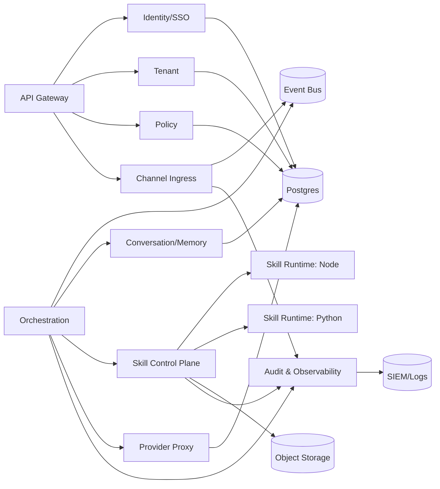
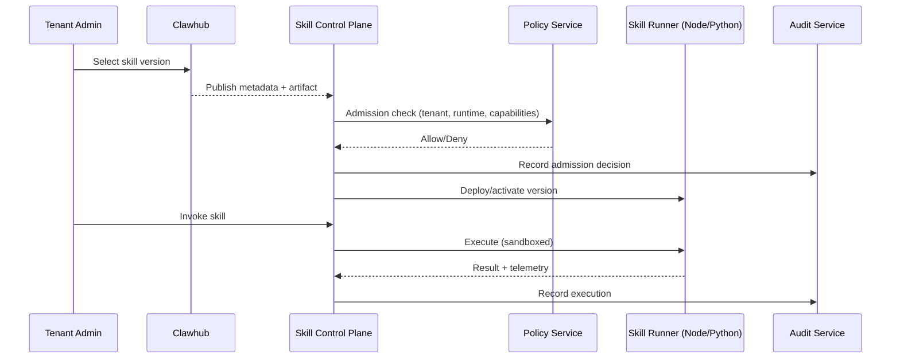
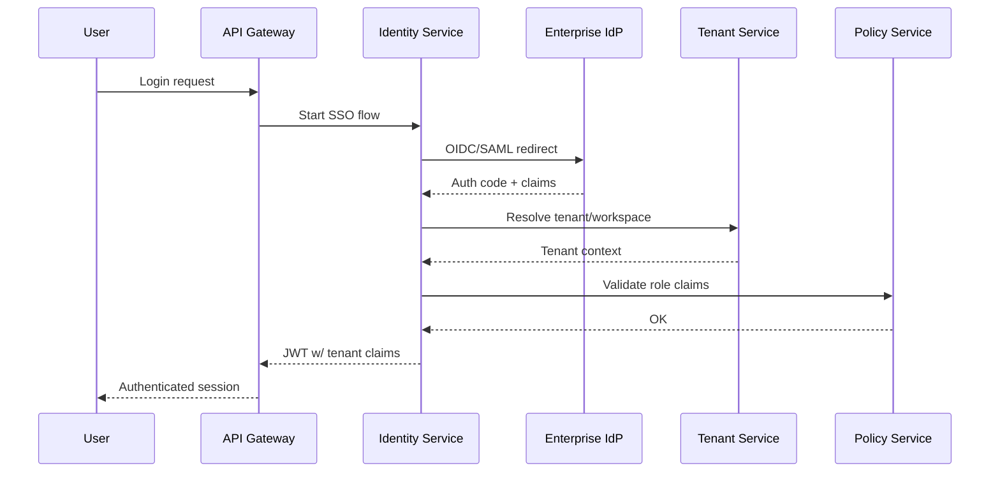

# Enterprise Microservices Architecture (Kubernetes + Multi-Tenant)

This document provides component and system architecture diagrams, plus milestone-based delivery with sign-off gates.

## System Context (C4 L1)

```mermaid
flowchart TB
  subgraph External
    Users[End Users]
    Admins[Tenant Admins]
    IdP[Enterprise IdP\n(OIDC/SAML)]
    Channels[Channel Platforms\nSlack/Discord/Telegram/etc]
    Clawhub[Clawhub]\n
  end

  subgraph OpenClawEnterprise[OpenClaw Enterprise Platform]
    Edge[API Gateway / Edge]
    Identity[Identity & SSO Service]
    Tenant[Tenant Service]
    Policy[Policy Service]
    Orchestrator[Orchestration Service]
    ChannelIngress[Channel Ingress Service]
    SkillControl[Skill Control Plane]
    SkillNode[Skill Runtime\n(Node.js)]
    SkillPython[Skill Runtime\n(Python)]
    Conversation[Conversation & Memory Service]
    ProviderProxy[Provider Proxy]
    Audit[Audit & Observability]
  end

  subgraph Data
    Postgres[(Postgres)]
    Redis[(Redis)]
    Bus[(Event Bus)]
    ObjectStore[(Object Storage)]
    SIEM[(SIEM / Log Sink)]
  end

  Users --> Edge
  Admins --> Edge
  Edge --> Identity
  Identity <--> IdP
  Edge --> Tenant
  Edge --> Policy
  Channels --> ChannelIngress
  ChannelIngress --> Bus
  Orchestrator --> Bus
  Orchestrator --> SkillControl
  SkillControl --> SkillNode
  SkillControl --> SkillPython
  Orchestrator --> Conversation
  Orchestrator --> ProviderProxy
  Audit --> SIEM

  Tenant --> Postgres
  Identity --> Postgres
  Policy --> Postgres
  Conversation --> Postgres
  Conversation --> ObjectStore
  SkillControl --> Postgres
  SkillControl --> ObjectStore
  Orchestrator --> Redis
  Orchestrator --> Bus
  Audit --> Postgres
```

## Service Container Diagram (C4 L2)



## Kubernetes Deployment (Logical)

```mermaid
flowchart TB
  subgraph NamespaceProd[prod namespace]
    Ingress[Ingress Controller + WAF]
    Mesh[Service Mesh (mTLS)]
    Edge[API Gateway]
    Identity[Identity]
    Tenant[Tenant]
    Policy[Policy]
    ChannelIngress[Channel Ingress]
    Orchestrator[Orchestration]
    Conversation[Conversation/Memory]
    SkillControl[Skill Control Plane]
    SkillNode[Skill Runner Node]
    SkillPython[Skill Runner Python]
    ProviderProxy[Provider Proxy]
    Audit[Audit/Observability]
  end

  subgraph DataPlane[Stateful Services]
    Postgres[(Postgres HA)]
    Redis[(Redis)]
    Bus[(Event Bus)]
    ObjectStore[(Object Storage)]
  end

  Ingress --> Edge
  Edge --> Mesh
  Mesh --> Identity
  Mesh --> Tenant
  Mesh --> Policy
  Mesh --> ChannelIngress
  Mesh --> Orchestrator
  Mesh --> Conversation
  Mesh --> SkillControl
  Mesh --> ProviderProxy
  Mesh --> Audit
  SkillControl --> SkillNode
  SkillControl --> SkillPython
  Identity --> Postgres
  Tenant --> Postgres
  Policy --> Postgres
  Conversation --> Postgres
  Conversation --> ObjectStore
  Orchestrator --> Redis
  Orchestrator --> Bus
  ChannelIngress --> Bus
```

## Skill Lifecycle Sequence (Clawhub → Runtime)



## SSO Login + Tenant Resolution Sequence



## Milestones & Sign-off Gates (Component-by-Component)

### Milestone 0 — Architecture Sign-off
- Diagrams + service boundaries approved
- Canonical tenant/auth context spec (`tenant_id`, `workspace_id`, `roles`, `entitlements`)
- Contract skeletons (OpenAPI/AsyncAPI)

### Milestone 1 — Identity Service (SSO MVP)
- OIDC flow, JWT issuance, session/refresh handling
- **Unit tests**: token mint/verify, claim mapping, tenant resolution, invalid issuer/audience
- **Sign-off**: local K8s login demo

### Milestone 2 — Tenant Service
- Tenant/workspace CRUD, quotas, policy attachment
- **Unit tests**: isolation checks, quota evaluation, validation errors
- **Sign-off**: tenant APIs deployed locally

### Milestone 3 — Policy Service
- Central authz decisions (RBAC+ABAC)
- **Unit tests**: allow/deny matrix, default-deny, cross-tenant protections
- **Sign-off**: policy outcomes verified

### Milestone 4 — Channel Ingress Service
- Canonical event model + webhook adapter (start with 1 channel)
- **Unit tests**: payload normalization, signature verification, idempotency
- **Sign-off**: inbound event flow working in local cluster

### Milestone 5 — Orchestration Service
- Workflow state transitions + tool/skill routing
- **Unit tests**: state machine transitions, retry/backoff, idempotency
- **Sign-off**: event → run orchestration verified

### Milestone 6 — Skill Control Plane
- Clawhub intake + signature checks + rollout policy
- **Unit tests**: admission policy, signature validation, rollout rules
- **Sign-off**: publish/admit lifecycle verified

### Milestone 7 — Skill Runtime Planes
- 7a: Node runner pool (sandboxed)
- 7b: Python runner pool (sandboxed)
- **Unit tests**: runtime bootstrap, timeout enforcement, capability profile checks
- **Sign-off**: skill execution in local K8s

### Milestone 8 — Conversation + Provider Proxy + Audit
- Conversation/memory isolation, provider proxy, audit stream
- **Unit tests**: tenant partitioning, provider policy, audit integrity
- **Sign-off**: full enterprise flow verified

### Milestone 9 — Hardening + Readiness
- Autoscaling, chaos, resilience, performance
- **Unit tests**: coverage gates pass
- **Sign-off**: readiness review

## Local K8s Sign-off Loop

Each milestone uses the same loop:
1. Implement a single service.
2. Add unit tests for that service.
3. Run service-level CI checks and coverage gates.
4. Build image and deploy into local K8s (kind/minikube/k3d).
5. Run milestone-specific smoke tests.
6. You review and sign off before next milestone.

Suggested directory for local manifests: `deploy/k8s/local/` (values + overrides).
