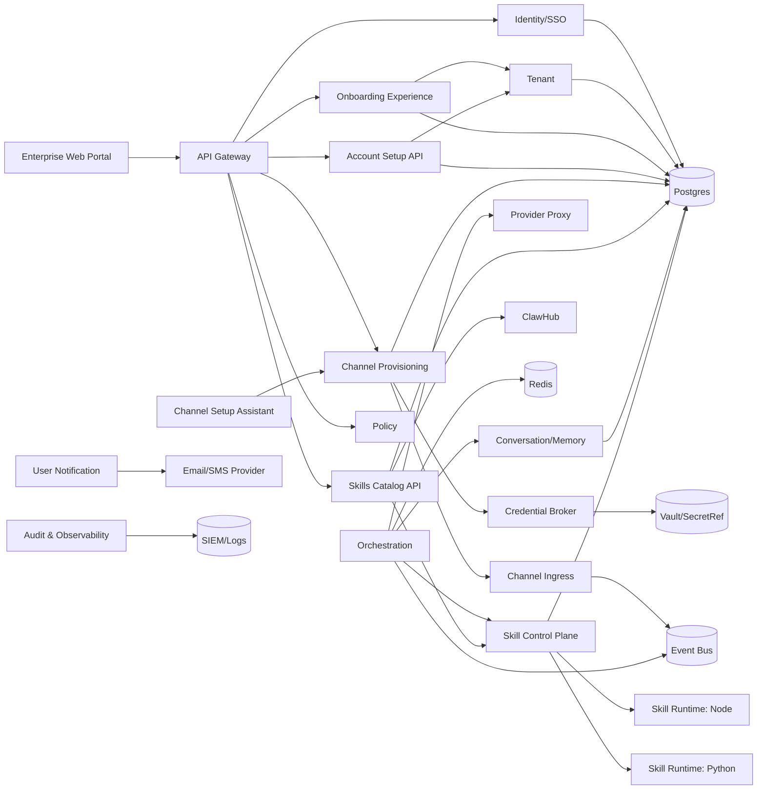
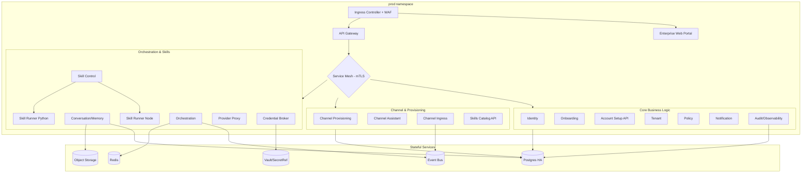
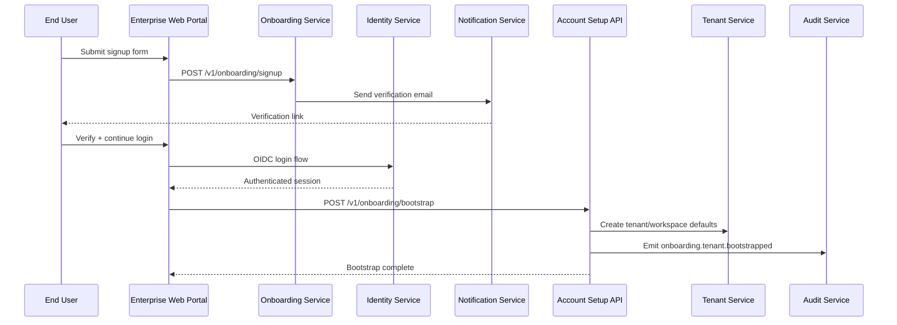
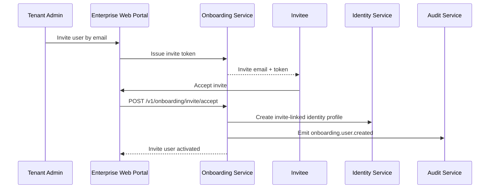
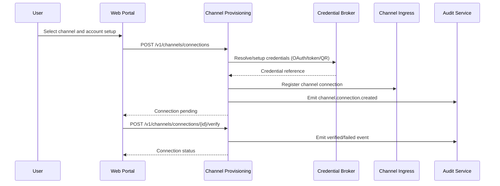
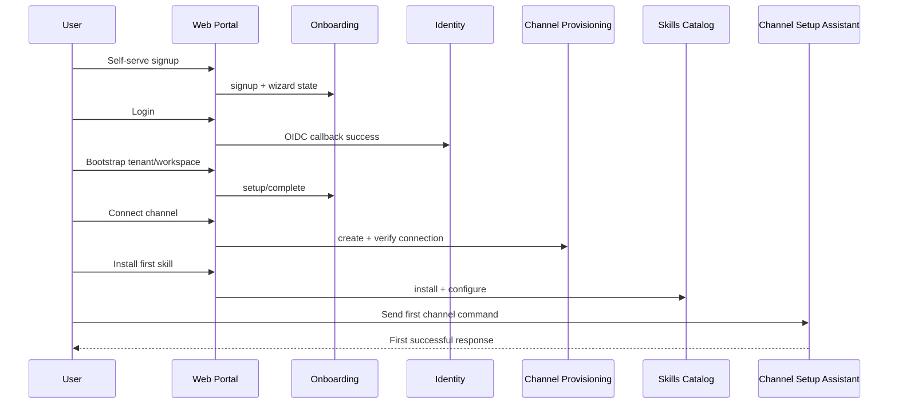
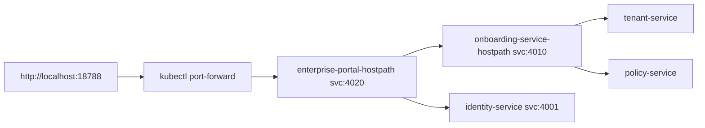

# Enterprise Microservices Architecture (Kubernetes + Multi-Tenant + Non-Technical UX)

This document provides the secure enterprise service architecture and the UX expansion needed for non-technical setup and operation.

## System Context (C4 L1)

```mermaid
flowchart TB
  %% =========================
  %% External
  %% =========================
  subgraph External
    Users[End Users]
    Admins[Tenant Admins]
    IdP["Enterprise IdP<br/>(OIDC/SAML)"]
    Channels[Channel Platforms<br/>WhatsApp / Telegram / Slack / etc]
    Clawhub[ClawHub]
    Mail[Email / Notification Providers]
  end

  %% =========================
  %% OpenClaw Enterprise Platform
  %% =========================
  subgraph OpenClawEnterprise[OpenClaw Enterprise Platform]
    WebPortal[Enterprise Web Portal]
    Edge[API Gateway / Edge]
    Identity[Identity & SSO Service]
    Onboarding[Onboarding Experience Service]
    AccountSetup[Account Setup API]
    Tenant[Tenant Service]
    Policy[Policy Service]
    ChannelProvision[Channel Provisioning Orchestrator]
    ChannelAssistant[Channel Setup Assistant]
    ChannelIngress[Channel Ingress Service]
    Orchestrator[Orchestration Service]
    Conversation[Conversation & Memory Service]
    ProviderProxy[Provider Proxy]
    SkillsCatalog[Skills Catalog & Install API]
    SkillControl[Skill Control Plane]
    SkillNode["Skill Runtime (Node.js)"]
    SkillPython["Skill Runtime (Python)"]
    CredentialBroker[Credential Broker]
    Notification[User Notification Service]
    Audit[Audit & Observability]
  end

  %% =========================
  %% Data Layer
  %% =========================
  subgraph Data
    Postgres["(Postgres)"]
    Redis["(Redis)"]
    Bus["(Event Bus)"]
    ObjectStore["(Object Storage)"]
    Vault["(Vault / SecretRef)"]
    SIEM["(SIEM / Log Sink)"]
  end

  %% =========================
  %% Flows
  %% =========================

  Users --> WebPortal
  Admins --> WebPortal
  WebPortal --> Edge

  Edge --> Identity
  Edge --> Onboarding
  Edge --> AccountSetup
  Edge --> ChannelProvision
  Edge --> SkillsCatalog

  Identity <--> IdP

  Onboarding --> Tenant
  AccountSetup --> Tenant

  ChannelProvision --> CredentialBroker
  ChannelAssistant --> ChannelProvision
  ChannelProvision --> ChannelIngress

  Channels --> ChannelIngress
  ChannelIngress --> Bus

  Orchestrator --> Bus
  Orchestrator --> Conversation
  Orchestrator --> ProviderProxy
  Orchestrator --> SkillControl

  SkillControl --> SkillNode
  SkillControl --> SkillPython

  SkillsCatalog --> SkillControl
  SkillsCatalog --> Clawhub

  Notification --> Mail
  Audit --> SIEM

  Identity --> Postgres
  Tenant --> Postgres
  Policy --> Postgres
  Onboarding --> Postgres
  AccountSetup --> Postgres
  ChannelProvision --> Postgres
  SkillsCatalog --> Postgres
  Conversation --> Postgres
  Conversation --> ObjectStore
  SkillControl --> Postgres
  SkillControl --> ObjectStore
  Orchestrator --> Redis
  CredentialBroker --> Vault
  Audit --> Postgres
```

## Service Container Diagram (C4 L2)

## Kubernetes Deployment (Logical)

## Sequence: Self-Serve Signup to Bootstrap

## Sequence: Invite-Only Activation

## Sequence: Guided Channel Connection

## Sequence: Skill Install from UI + Channel Invocation

```mermaid
sequenceDiagram
  participant User as User
  participant Portal as Web Portal
  participant Skills as Skills Catalog API
  participant Clawhub as ClawHub
  participant Control as Skill Control Plane
  participant Assistant as Channel Setup Assistant
  participant Runtime as Skill Runtime
  participant Audit as Audit Service

  User->>Portal: Browse skill catalog
  Portal->>Skills: GET /v1/skills/catalog
  Skills->>Clawhub: Resolve metadata and versions
  User->>Portal: Install skill
  Portal->>Skills: POST /v1/skills/install
  Skills->>Control: Admit + activate skill
  Skills->>Audit: Emit skill.install.completed
  User->>Assistant: /skill <name> <input>
  Assistant->>Runtime: Execute skill
  Runtime->>Audit: Record skill execution
  Runtime-->>Assistant: Result
```

## Sequence: First-Run Happy Path E2E

## Local Kubernetes implementation (Milestone 17)

- Portal is now implemented as `@openclaw/enterprise-portal`.
- The portal provides browser pages for signup, invite accept, login/callback, bootstrap, channels, and skills.
- The portal backend proxies UX API calls to onboarding + identity services inside cluster.

## Milestones & Sign-off Gates (including UX expansion)

### Milestones 0-9

Completed secure microservice modernization milestones and readiness hardening.

### Milestone 10 — UX Architecture + Contract Baseline

- Deliver UX architecture updates + OpenAPI/AsyncAPI baseline.
- **Unit tests**: contract lint/validation checks.
- **Sign-off**: architecture and contract acceptance.

### Milestone 11 — Signup/Login + Invite UX

- Self-serve signup + invite acceptance UX/backend.
- **Unit tests**: signup validation, invite token lifecycle, session/login wiring.
- **Sign-off**: non-technical signup/login flow approved.

### Milestone 12 — Account Bootstrap Wizard

- Wizard-based tenant/workspace bootstrap and setup state tracking.
- **Unit tests**: wizard transitions, idempotent bootstrap, failure paths.
- **Sign-off**: account bootstrap approved.

### Milestone 13 — All-Channels Provisioning UX

- Unified provisioning orchestrator for supported channels.
- **Unit tests**: per-channel adapter validation and connection verification.
- **Sign-off**: multi-channel setup approved.

### Milestone 14 — Skills Catalog/Install/Configure UX

- ClawHub-backed skill catalog install/config workflows.
- **Unit tests**: install orchestration, config persistence, missing requirements.
- **Sign-off**: skill setup UX approved.

### Milestone 15 — In-Channel Guided Setup UX

- Conversational setup assistant with web wizard state sync.
- **Unit tests**: command routing, authz, state sync.
- **Sign-off**: in-channel onboarding approved.

### Milestone 16 — UX Hardening + Accessibility + E2E Readiness

- A11y pass, failure-recovery UX, full E2E readiness integration.
- **Unit tests**: accessibility and recovery logic.
- **Sign-off**: enterprise UX go/no-go.

### Milestone 17 — Enterprise Web Portal Delivery

- Implement browser-first portal UX and in-cluster deployment wiring.
- **Unit tests**: portal proxy mapping + forwarding.
- **Sign-off**: end-to-end browser onboarding flow runs in local Kubernetes.
